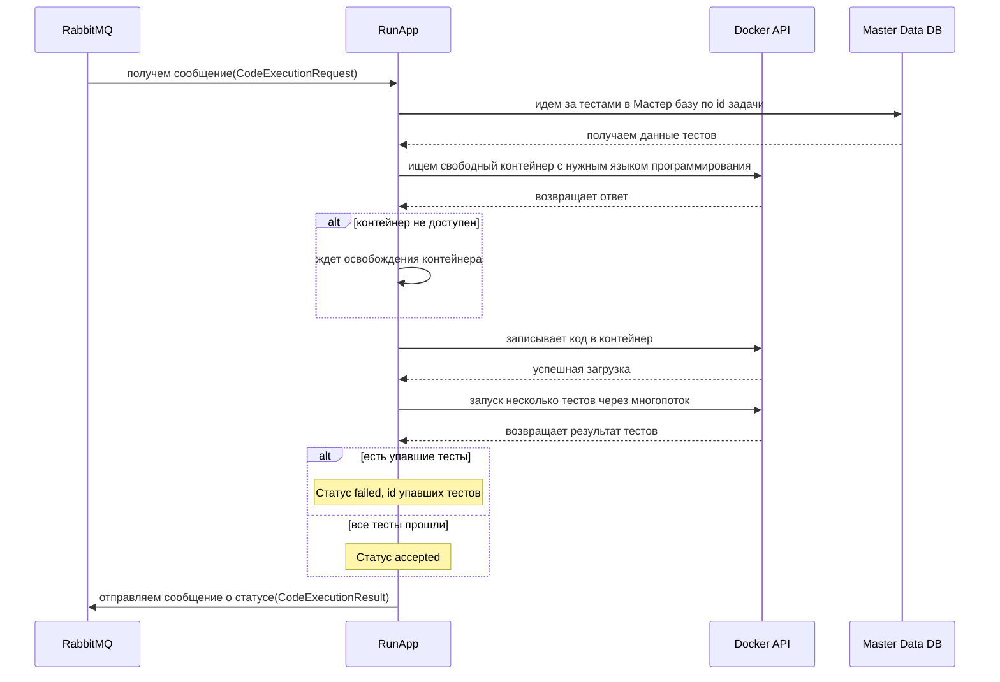

Примерный флоу по обработке запроса



```csharp
public class CodeExecutionRequest
{
    public string Code { get; set; }
    public string Language { get; set; }
    public string Tests { get; set; }
    public string CorrelationId { get; set; }
    public Guid PackageId { get; set; }
}
```

```csharp
public class CodeExecutionResult
{
    public int PassedTests { get; set; }
    public int FailedTests { get; set; }
    public List<FailedTest> FailedTests { get; set; }
    public string CorrelationId { get; set; }
    public Guid PackageId { get; set; }
}

public struct FailedTest
{
	public Guid TestId { get; set; }
	public string Reason { get; set; }
}
```